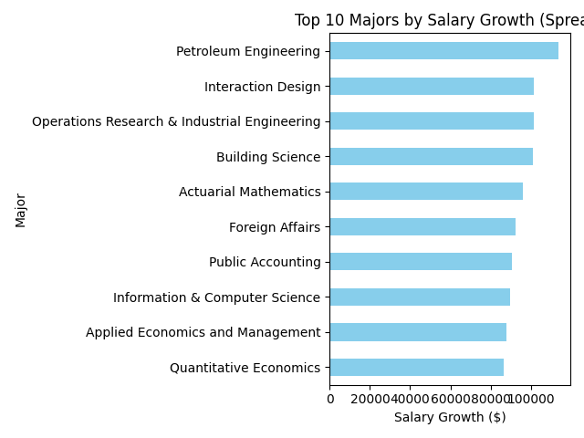

# Payscale Salary Insights 📊💼

This project scrapes salary data for different college majors and analyzes it to provide insights into early career pay, mid-career pay, and career growth. The project includes data collection using web scraping, data cleaning, and in-depth analysis, followed by uploading the results to Google Sheets for easy sharing and collaboration.

## Features ✨

- **Web Scraping**: 🕸️ Uses Selenium to extract salary data for various college majors from the Payscale website.
- **Data Cleaning**: 🧹 Cleans and processes the scraped data to remove inconsistencies and prepare it for analysis.
- **Data Analysis**: 📈 Analyzes the data to calculate career growth in terms of salary difference between early and mid-career.
- **Google Sheets Integration**: 📊 Uploads the cleaned and analyzed data to Google Sheets for easy access and sharing.

## Tech Stack 💻

- **Python**: 🐍 Main programming language used for scripting and analysis.
- **Selenium**: 🚀 Web scraping tool for extracting data from web pages.
- **Pandas**: 🧑‍💻 Data manipulation and analysis.
- **Matplotlib**: 📊 Data visualization for graphical representation of results.
- **gspread**: 📜 For uploading data to Google Sheets.
- **Google Cloud API**: ☁️ For authenticating and connecting to Google Sheets using Service Account credentials.



## How to Run the Project 🚀

### 1. **Clone the Repository** 
Clone this repository to your local machine or Google Colab environment.

```bash
git clone https://github.com/lipivirmani/Payscale-salary-insights.git
cd Payscale-salary-insights
```

### 2. **Install Dependencies** 
Make sure to install the necessary dependencies listed in the `requirements.txt` file. You can install them using pip:

```bash
pip install -r requirements.txt
```

### 3. **Web Scraping** 
Run the `main.py` script to scrape the data:

```bash
python main.py
```

This will collect the salary data for various majors and save it in a CSV file (`payscale_cleaned.csv`).

### 4. **Data Cleaning** 
Once the data is collected, run the `clean_data.py` script to clean the scraped data:

```bash
python clean_data.py
```

This script will clean the data and save it as `payscale_cleaned.csv`.

### 5. **Data Analysis** 
Once the data is cleaned, run the `analysis.py` script to analyze the salary trends:

```bash
python analysis.py
```

This script will calculate the salary growth and save the analysis in a CSV file (`spread_analysis.csv`).

### 6. **Upload to Google Sheets** 
To upload the cleaned data and analysis to Google Sheets, run the `GoogleApi.py` script:

```bash
python GoogleApi.py
```

You will need to authenticate with your Google API credentials to access your Google Sheets account.

## Google Sheets Integration 📑

This project uses the `gspread` library to upload the results to a Google Sheet for easy sharing and collaboration. The script will create a new Google Sheet named "Major Salary Survey" and upload the cleaned data as well as the analysis.

### Google Cloud API Setup ⚙️
To use Google Sheets API, you need to set up a Google Cloud project and download the API credentials file. Ensure that the Google Sheets API and Drive API are enabled for your project, and grant the necessary permissions to the service account.

## Collaboration and Sharing with Google Colab 🧑‍🤝‍🧑

For collaboration or running the code on the cloud, you can use **Google Colab**.

### 1. **Upload Project Files to Google Drive** 
Upload the project files to your Google Drive.

### 2. **Set Up Google Colab** 
Open [Google Colab](https://colab.research.google.com/) and start a new notebook. Mount your Google Drive and install dependencies as needed.

### 3. **Running Scripts in Colab** 
Run the scripts directly from Colab by using the correct paths to the project files stored in Google Drive.


## Contributing 🤝

Feel free to open issues or submit pull requests if you want to contribute to this project. Please make sure to follow best practices for code and commit messages.

---

**Created by Lipi Virmani ✨**
